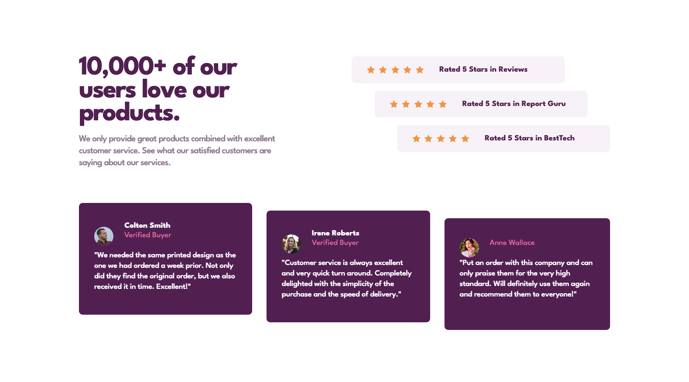

# Social proof section solution

This is a solution to the [Social proof section challenge on Frontend Mentor](https://www.frontendmentor.io/challenges/social-proof-section-6e0qTv_bA).

## Table of contents

-   [Screenshot](#screenshot)
-   [Links](#links)
-   [Built with](#built-with)
-   [Author](#author)

## Screenshot

## Links

-   [Solution URL](https://github.com/ionStici/social-proof-section-master)
-   [Live Site URL](https://ionstici.github.io/social-proof-section-master)

## Built with

-   Semantic HTML5 markup
-   CSS Grid and Flexbox
-   Mobile-first workflow

## Author

-   [GitHub](https://github.com/ionStici)
-   [Frontend Mentor](https://www.frontendmentor.io/profile/ionStici)
-   [Twitter](https://twitter.com/ionStici_)

<!-- # Front-end Style Guide

## Layout

The designs were created to the following widths:

- Mobile: 375px
- Desktop: 1440px

## Colors

### Primary

Very Dark Magenta: hsl(300, 43%, 22%)
Soft Pink: hsl(333, 80%, 67%)

### Neutral

Dark Grayish Magenta: hsl(303, 10%, 53%)
Light Grayish Magenta: hsl(300, 24%, 96%)
White: hsl(0, 0%, 100%)

## Typography

### Body Copy

- Font size: 15px

### Font

- Family: [League Spartan](https://fonts.google.com/specimen/League+Spartan)
- Weights: 400, 500, 700 -->
